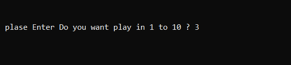
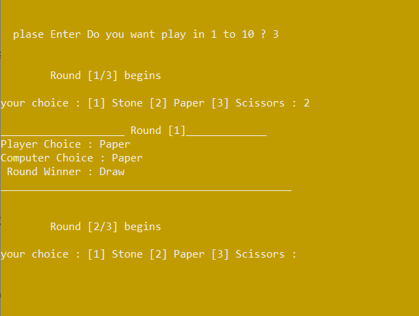
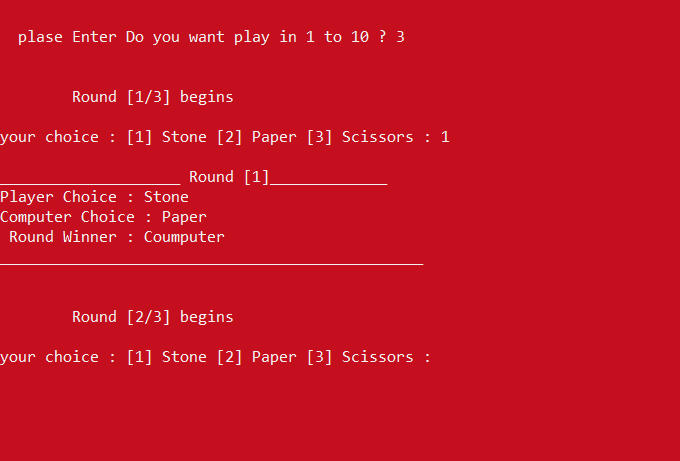
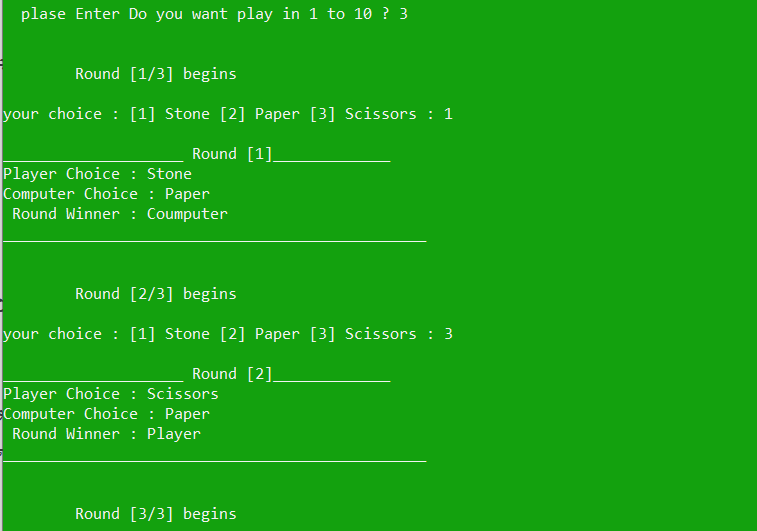
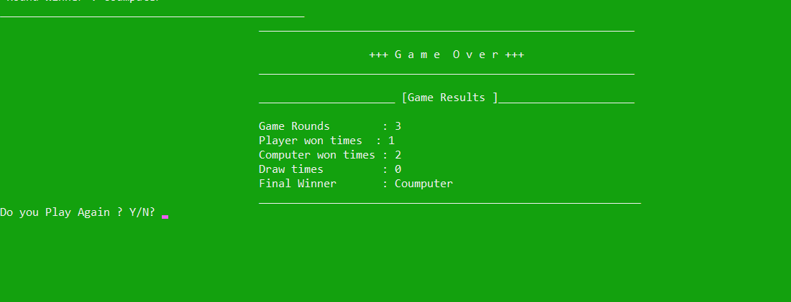

# Rock-Paper-Scissors Game

This C++ program implements the classic game of Rock-Paper-Scissors between the player and the computer. The game can be played for multiple rounds, and it tracks the score of each round as well as the overall game result.

## Features:

- **Multiple Rounds:**  
  The user can select the number of rounds they want to play (between 1 and 10).

  

- **Player vs Computer:**  
  The user chooses rock, paper, or scissors, while the computer randomly selects one.

  

- **Background Color Change:**  
  The player's choice is compared with the computer's choice, and the winner of the round is determined. The background color changes to red when the player loses, green when they win, and orange when it's a draw.

    
  

- **Score Tracking:**  
  The game keeps track of the number of rounds played, how many the player won, how many the computer won, and how many rounds ended in a draw.

- **Dynamic Winner Highlighting:**  
  The console background color changes based on the winner of each round (green for the player, red for the computer, yellow for a draw).

- **Final Results:**  
  At the end of all rounds, the game displays the total number of rounds played, how many times the player won, how many times the computer won, and declares the overall winner based on the number of rounds won.

  

## How to Run

1. Clone the repository to your local machine.
2. Compile the code using a C++ compiler.
3. Run the executable.
4. Follow the prompts to play the game.
